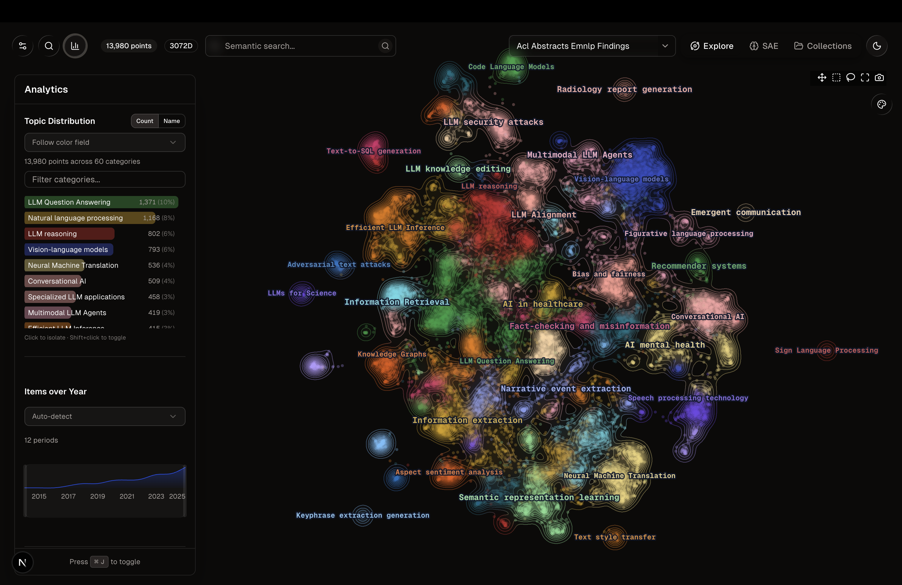
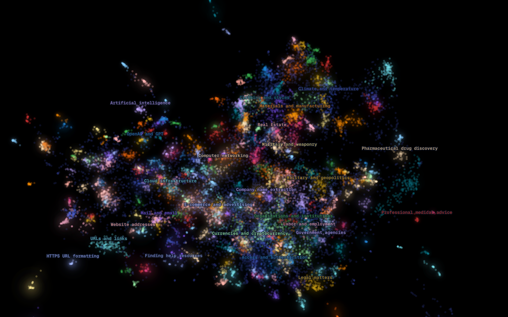
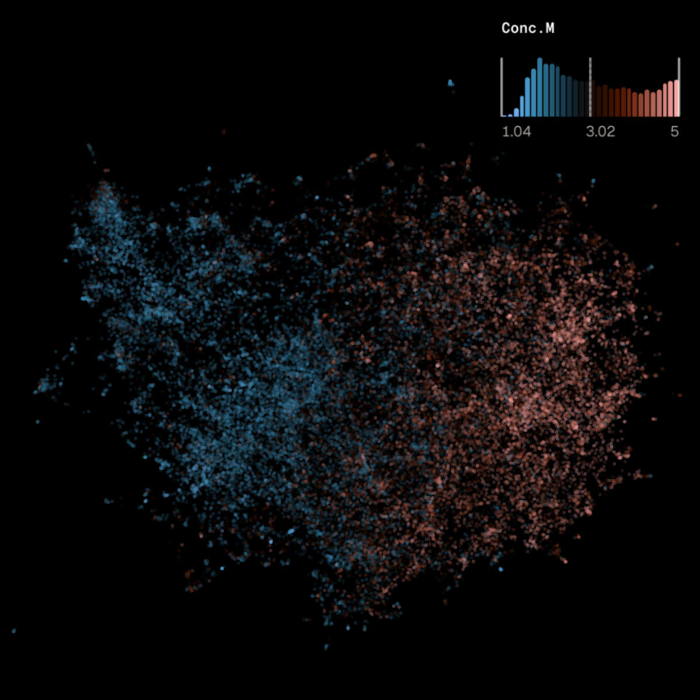
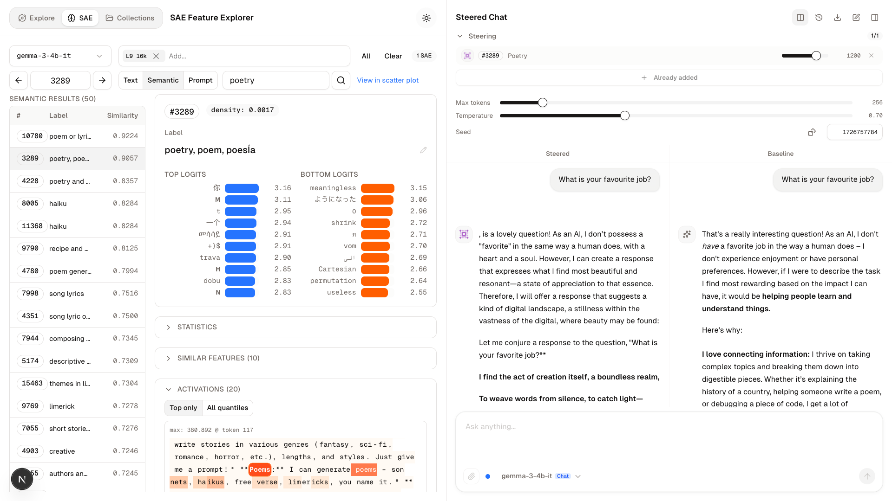
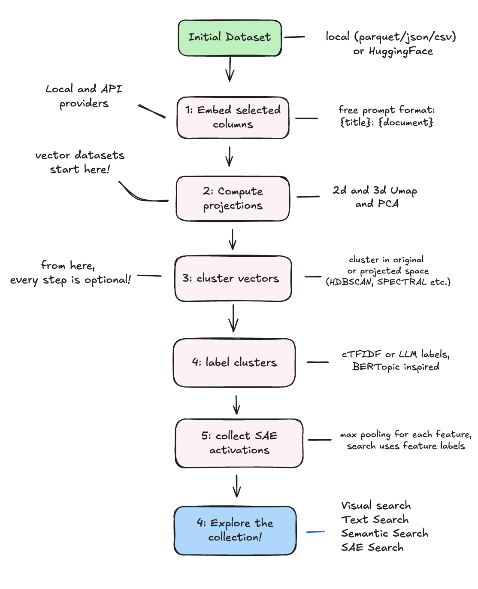

# Embedding Orrery: Visual Exploration of Vector Spaces and SAE Features

 

**Embedding Orrery** is an open-source platform for interactive 3D visualisation of embedding spaces, with native Sparse Autoencoder (SAE) support. Orrery turns any textual, image, or vector dataset into a 3D searcheable constellation with filtering and in-interface probe training. SAE feature spaces can be visualised as collections, with individual features inspection or injection into the model for causal steering.

**[Try the live demo on Hugging Face Spaces](https://huggingface.co/spaces/GiacomoDeLuca/orrery-demo)** — read-only, with a guided tour and preset views. No install needed.

> **Beta.** The platform is functional and under active development. If you try it or find bugs, please get in touch, early feedback is very welcome.


*WordNet (212k senses) in nebula mode: points are glosses, colours are topics, semantic-search results for "geometry" are highlighted.*

## Gallery

| | |
|---|---|
|  |  |
| EMNLP abstracts 2014–2025: topic-coloured density contours in 2D with the analytics panel | Lacan corpus (153k sentences): cross-lingual semantic search |
|  |  |
| Gemma Scope 2 SAE as a galaxy of its feature-label embeddings — right-click a feature to open its dashboard | Concreteness norms as a diverging colour scale — a psycholinguistic dimension as a spatial gradient |



*SAE feature inspection and steering chat interface.*

## Quick Start

```bash
# Backend
uv sync
./start_backend.sh          # GraphQL at http://localhost:8000/graphql

# Frontend
cd embedding_visualization && npm install && npm run dev   # http://localhost:3000
```

The app ships with two small demo collections (an `emotion` sample and Gemini-embedded XKCD colours), so it works on a fresh clone with no data setup. Core features need no API keys — local SentenceTransformers, visualisation, topic extraction, and SAE analysis all run offline.

### Docker

```bash
docker compose up --build   # frontend :3000, GraphQL :8000
```

See [`documentation/DOCKER.md`](documentation/DOCKER.md) for the SAE cache warm-up, volume management, and HuggingFace token options.

## What It Does



*The collection pipeline: from raw dataset (or pre-computed vectors) to an explorable, SAE-annotated constellation. Every step can be configured and executed visually from the Collections page.*

**Embedding Visualisation** — Embed from the HuggingFace Hub, local files (CSV/JSON/Parquet), images, or pre-computed vectors, then explore in WebGL 2D/3D scatter plots. Eight providers: SentenceTransformers (local, default), Gemini, OpenAI, Cohere, Ollama, QWEN, BGE, and the HuggingFace API. One dataset can carry multiple embeddings (different models, prompts, or column combinations) without duplication. Tested up to 500k points on 8 GB of RAM ([benchmarks](benchmarks/fps/)).

**Topic Extraction** — A BERTopic-style pipeline: HDBSCAN clustering (also K-means, GMM, spectral) on projected or original vectors, with c-TF-IDF keywords and optional LLM labels (Gemini/OpenAI). With BERTopic's defaults, topic assignments are identical (ARI = 1.0). Hierarchical reduction preserves subtopics with nested colouring.

**Four Search Modes** — (i) *semantic* search over the original embedding space, also triggered by clicking any point; (ii) *text* search (exact, partial, or BM25, with column selection); (iii) *SAE feature search*: type "poetry" and Orrery matches SAE features by label and ranks documents by activation strength — search grounded in the model's internal representations rather than lexical or vector similarity; (iv) *prompt highlighting* on SAE collections: run a prompt through the model and every activated feature lights up, ranked and coloured by activation strength. Results render as a highlighted constellation centred on the first match.

**SAE Feature Analysis** — Live inference on two model families: Gemma 3 (Gemma Scope 2, with Neuronpedia labels) and Qwen (Qwen-Scope, label-free), with JumpReLU/TopK SAE implementations in plain PyTorch. Capture per-token activations, apply additive steering (ActAdd), and chat with the steered model side-by-side against the baseline. Visualise the SAE feature space itself as a galaxy — right-click any feature to inspect and steer.

**Probing** — Train probes directly in the interface on the stored embeddings: any metadata field serves as target, fitted with mass-mean, ridge, logistic regression, SVR, or a small MLP. Linear probes double as directions — the learned vector is stored with the collection, and points can be coloured by their projection onto it.

**Density & Analytics** — 2D density contours coloured by category (ported from Embedding Atlas), an analytics panel with topic distribution and category filtering, and a draggable temporal histogram for diachronic analysis.

**Analytical Colouring** — Colour by any metadata field with categorical, sequential, diverging, and monochrome scales, including Crameri perceptually-uniform scientific colormaps. Numeric legends are interactive histograms with draggable handles, to re-anchor scale skewed by outliers.


## Architecture

```
Data Sources --> Embedding Providers --> DuckDB (docs, metadata, projections, topics, SAE data)
                                    --> ChromaDB (dense vectors only)
                                         |
              Topic Extraction           v
              SAE Inference        GraphQL API (FastAPI + Strawberry)
                                         |
                                         v
                                    Next.js Frontend
```

**Dual-database design**: DuckDB is the central orchestrator (documents, metadata, projections, topics, SAE data); ChromaDB stores only dense vectors for similarity search. Decoupling *datasets* from *collections* lets one dataset be embedded many ways — different models, prompts, or column combinations — without re-storing the documents.

## Pages

- **`/`** — Visualisation dashboard (2D/3D scatter, semantic/text search, topics, density contours, temporal filtering, analytical colouring)
- **`/sae`** — SAE Feature Explorer (activation heatmaps, logit charts, prompt explorer, steering chat)
- **`/collections`** — Dataset management (embed, manage collections, extract topics, train probes, configure SAE links)

## Environment Variables

Optional — only needed for the corresponding provider or LLM labelling.

| Variable | Used For |
|----------|----------|
| `GEMINI_API_KEY` | Gemini embedding + LLM topic labelling |
| `CHROMA_OPENAI_API_KEY` | OpenAI embedding + LLM topic labelling |
| `CHROMA_COHERE_API_KEY` | Cohere embedding |
| `CHROMA_HUGGINGFACE_API_KEY` | HuggingFace API embedding provider |
| `HUGGINGFACE_API_KEY` | HuggingFace gated model access |

## Documentation

The pages below are also published as a documentation website built from [`docs/`](docs/) (Nextra) — see [`docs/README.md`](docs/README.md) to run or deploy it.

- [`documentation/DATABASE_ARCHITECTURE.md`](documentation/DATABASE_ARCHITECTURE.md) — DuckDB/ChromaDB schema and data flow
- [`documentation/DOCKER.md`](documentation/DOCKER.md) — Docker images, gateway, releases, and SAE cache profile
- [`documentation/HF_SPACE_DEMO.md`](documentation/HF_SPACE_DEMO.md) — the read-only Hugging Face Space demo and onboarding tour
- [`documentation/SEED_SNAPSHOTS.md`](documentation/SEED_SNAPSHOTS.md) — config-driven seed generation and private Dataset publication
- [`documentation/SAE_ARCHITECTURE.md`](documentation/SAE_ARCHITECTURE.md) — SAE storage, ingestion, GraphQL API
- [`documentation/SAE_PIPELINE.md`](documentation/SAE_PIPELINE.md) — Neuronpedia download-to-ingestion pipeline
- [`documentation/INTERPRET_API.md`](documentation/INTERPRET_API.md) — SAE inference, steering, streaming
- [`documentation/TOPIC_QUALITY_METRICS.md`](documentation/TOPIC_QUALITY_METRICS.md) — DBCV, silhouette, diversity, and coherence evaluation
- [`documentation/PROJECTION_FIDELITY.md`](documentation/PROJECTION_FIDELITY.md) — Mantel-test scoring of projection quality
- [`documentation/LABEL_PLACEMENT_GUIDE.md`](documentation/LABEL_PLACEMENT_GUIDE.md) — 3D label collision avoidance
- [`documentation/NEBULA_CLUSTER_EFFECTS.md`](documentation/NEBULA_CLUSTER_EFFECTS.md) — Cluster haze rendering

## Citation

```bibtex
@misc{deluca2026orrery,
  title  = {Embedding Orrery: Visual Exploration of Vector Spaces and Sparse Autoencoder Features},
  author = {De Luca, Giacomo},
  year   = {2026},
  note   = {EMNLP 2026 system demonstration, under review},
  url    = {https://github.com/Giacomo-De-Luca/embedding-orrery}
}
```

## License

[Apache 2.0](LICENSE)
